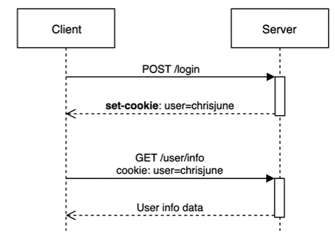
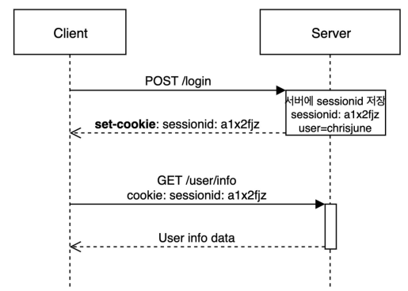

# Part A. 로그인, 로그아웃, 회원가입으로 배워보는 스프링 시큐리티 기초
## Ch 1. 보안기초
### 01. 보안이란?
- 보안은 "안전"을 지키는 것 : 안전한 상태를 지키는 각종 활동
- Spring security는 `애플리케이션 수준` 보안에 속하는 프레임 워크
- 인증 : 애플리케이션이 사용자를 식별하는 방법
- 권한 부여 : 식별 후 사용자가 무엇을 할 수 있는지를 허용/제한하기 위한 방법

### 02. 보안의 기초 - 1
- HTTP : HyperText Transfer Protocol : 인터넷에서 데이터를 주고 받을 수 있는 프로토콜(규약)
    - 클라이언트와 서버는 HTTP를 이용해서 서로 통신함
    - 특성
        - Client-Server : 클라이언트-서버 구조 : 클라이언트가 서버에 요청(Request)을 보내면 서버가 그에 대한 응답(Response)을 하는 구조
        - Connectionless : 비연결성 : 클라이언트가 요청을 한 후 응답을 받으면 그 연결을 끊어 버리는 특징
        - Stateless : 무상태 : 통신이 끝나면 상태를 유지하지 않는 특징, 서버가 클라이언트의 상태를 보존하지 않음  

- 세션과 쿠키
    - HTTP 프로토콜의 비연결성, 무상태 라는 특성을 보완하기 위해 사용  

### 🍪Cookie
- 사용자가 어떤 웹 사이트를 방문할 경우에 그 사이트가 사용하고 있는 서버에서 사용자의 컴퓨터에 저장하는 작은 기록 정보 파일  
- HTTP에서 클라이언트의 상태 정보를 클라이언트의 PC에 저장해두었다가 필요시 참조하거나 재사용할 수 있음
- 목적1: 세션관리
- 목적2: 개인화
- 목적3: 트레킹  
- 종류
    - Session Cookie
        - 일반적으로 만료시간(espire date)을 설정하고 메모리에만 저장됨
        - 브라우저 종료 시 쿠키를 삭제함
    - Pesistent Cookie
        - 장기간 유지되는 쿠키
        - 파일로 저장되며 브라우저의 종료와 관계없이 사용함
    - Secure Cookie
        - HTTPS 프로토콜에서만 사용함
        - 쿠키 정보가 암호화되어 전송됨  
- 특징
    - 이름, 값, 만료일, 경로 정보로 구성됨
    - 클라이언트에 총 300개의 쿠키를 저장할 수 있다.
    - 하나의 도메인 당 20개의 쿠키를 가질 수 있다.
    - 하나의 쿠키는 4KB까지 저장 가능하다.  

### 03. 보안의 기초 - 2
### 🥓Session
- 일정시간동안 같은 사용자(브라우저)로부터 인입되는 일련의 요청을 하나의 상태로 간주하여, 그 상태를 일정하게 유지시키는 기술
- 웹 서버에 접속해 있는 상태를 하나의 단위로 보고 그것을 세션이라고 한다.

### HTTP 기본인증
- HTTP 헤더를 사용하는 인증 방법 중 하나
- 인증을 하기 위해서 HTTP 헤더에 아이디와 패스워드를 담아 서버에 보내면 됨.
