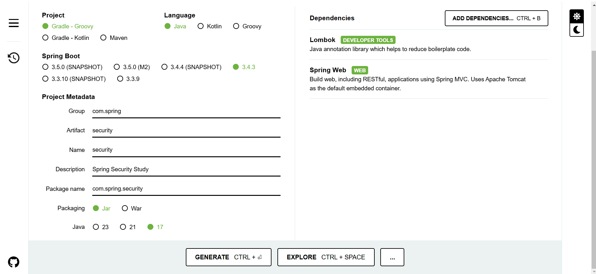
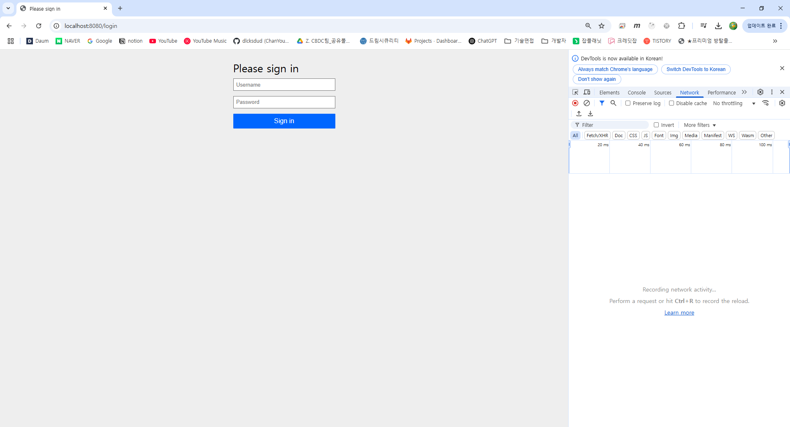
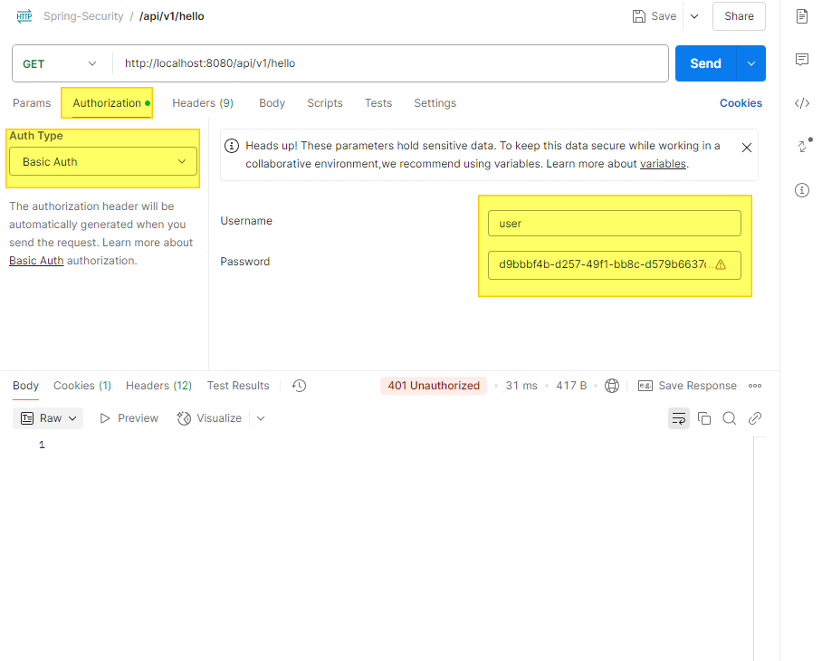

## Part A. 로그인, 로그아웃, 회원가입으로 배워보는 스프링 시큐리티 기초
### Ch 2. 스프링 시큐리티 기초
---

### 01. 스프링 시큐리티의 Hello World
- 2024년 7월 기준 최신버전은 6.3 버전
[https://github.com/spring-projects/spring-security](https://github.com/spring-projects/spring-security)

- 아래 명령어로 스프링 시큐리티 코드 받을 수 있음
```shell script
$ git clone git@github.com:spring-projects/spring-security.git
```

### 스프링 시큐리티 맛보기 REST API 만들기
- HTTP Basic 인증을 이용해서 사용자를 인증하고 권한부여
- 정의된 경로 (/api/v1/hello)를 REST API 엔드포인트로 노출함
- 응답 성공하면 HTTP 200 상태 메시지와 응답 본문 반환 : 200 OK "Hello, Spring Security"
```shell script
curl -u user:password http://localhost:8080/api/v1/hello
```
- 환경
    - IDE : IntelliJ
    - JAVA : Java17
    - Build : Gradle
    - Framework : SpringBoot 3.x, SpringSecurity 6.x

[https://start.spring.io](https://start.spring.io)


- Gradle 의존성 추가
```gradle
implementation 'org.springframework.boot:spring-boot-starter-security'
```
```
  .   ____          _            __ _ _
 /\\ / ___'_ __ _ _(_)_ __  __ _ \ \ \ \
( ( )\___ | '_ | '_| | '_ \/ _` | \ \ \ \
 \\/  ___)| |_)| | | | | || (_| |  ) ) ) )
  '  |____| .__|_| |_|_| |_\__, | / / / /
 =========|_|==============|___/=/_/_/_/

 :: Spring Boot ::                (v3.4.3)

2025-03-07T10:54:31.224+09:00  INFO 28716 --- [security] [           main] c.spring.security.SecurityApplication    : Starting SecurityApplication using Java 17.0.13 with PID 28716 (D:\dlcksdud\spring-security\PartA\Ch_2\security\build\classes\java\main started by cksdud5087 in D:\dlcksdud\spring-security\PartA\Ch_2\security)
2025-03-07T10:54:31.232+09:00  INFO 28716 --- [security] [           main] c.spring.security.SecurityApplication    : No active profile set, falling back to 1 default profile: "default"
2025-03-07T10:54:33.286+09:00  INFO 28716 --- [security] [           main] o.s.b.w.embedded.tomcat.TomcatWebServer  : Tomcat initialized with port 8080 (http)
2025-03-07T10:54:33.305+09:00  INFO 28716 --- [security] [           main] o.apache.catalina.core.StandardService   : Starting service [Tomcat]
2025-03-07T10:54:33.305+09:00  INFO 28716 --- [security] [           main] o.apache.catalina.core.StandardEngine    : Starting Servlet engine: [Apache Tomcat/10.1.36]
2025-03-07T10:54:33.397+09:00  INFO 28716 --- [security] [           main] o.a.c.c.C.[Tomcat].[localhost].[/]       : Initializing Spring embedded WebApplicationContext
2025-03-07T10:54:33.399+09:00  INFO 28716 --- [security] [           main] w.s.c.ServletWebServerApplicationContext : Root WebApplicationContext: initialization completed in 2067 ms
2025-03-07T10:54:33.939+09:00  WARN 28716 --- [security] [           main] .s.s.UserDetailsServiceAutoConfiguration : 

Using generated security password: d9bbbf4b-d257-49f1-bb8c-d579b6637dfa

This generated password is for development use only. Your security configuration must be updated before running your application in production.

2025-03-07T10:54:33.974+09:00  INFO 28716 --- [security] [           main] r$InitializeUserDetailsManagerConfigurer : Global AuthenticationManager configured with UserDetailsService bean with name inMemoryUserDetailsManager
2025-03-07T10:54:34.230+09:00  INFO 28716 --- [security] [           main] o.s.b.w.embedded.tomcat.TomcatWebServer  : Tomcat started on port 8080 (http) with context path '/'
2025-03-07T10:54:34.241+09:00  INFO 28716 --- [security] [           main] c.spring.security.SecurityApplication    : Started SecurityApplication in 3.751 seconds (process running for 4.934)

```
- 스프링 시큐리티가 적용된 애플리케이션의 엔드포인트를 호출하려면 위 비밀번호를 사용해야 함
    - UserDetailsServiceAutoConfiguration 에서 생성됨
    - 스프링 시큐리티가 기본으로 설정되어 있을 때, HTTP Basic 인증 방식으로 동작함(헤어로 아이디와 패스워드를 전달)


- 기본 사용자 아이디 user, 기본 비밀번호는 터미널에 제공된 값(UUID) 활용


- HTTP 401 에러
    - Unauthorized 상태 : 인증 실패를 의미함
    - 애플리케이션을 설계할 때 자격 증명이 누락되거나 잘못되었을 때 발생
- HTTP 403 에러
    - Forbidden : 호출자는 누구인지 식별했지만, 호출자에게 이용권리가 없을 때 발생
---

- postman 활용하기
[https://www.postman.com/downloads/](https://www.postman.com/downloads/)

