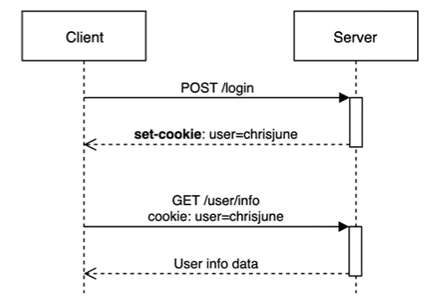
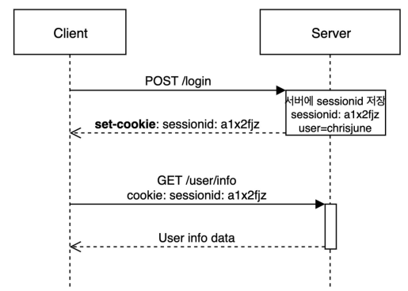
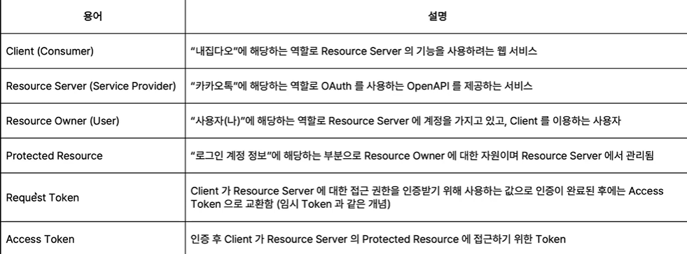
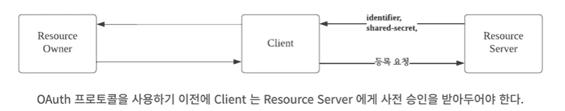

# Part A. 로그인, 로그아웃, 회원가입으로 배워보는 스프링 시큐리티 기초
## Ch 1. 보안기초
### 01. 보안이란?
- 보안은 "안전"을 지키는 것 : 안전한 상태를 지키는 각종 활동
- Spring security는 `애플리케이션 수준` 보안에 속하는 프레임 워크
- 인증 : 애플리케이션이 사용자를 식별하는 방법
- 권한 부여 : 식별 후 사용자가 무엇을 할 수 있는지를 허용/제한하기 위한 방법
---

### 02. 보안의 기초 - 1
- HTTP : HyperText Transfer Protocol : 인터넷에서 데이터를 주고 받을 수 있는 프로토콜(규약)
    - 클라이언트와 서버는 HTTP를 이용해서 서로 통신함
    - 특성
        - Client-Server : 클라이언트-서버 구조 : 클라이언트가 서버에 요청(Request)을 보내면 서버가 그에 대한 응답(Response)을 하는 구조
        - Connectionless : 비연결성 : 클라이언트가 요청을 한 후 응답을 받으면 그 연결을 끊어 버리는 특징
        - Stateless : 무상태 : 통신이 끝나면 상태를 유지하지 않는 특징, 서버가 클라이언트의 상태를 보존하지 않음  

- 세션과 쿠키
    - HTTP 프로토콜의 비연결성, 무상태 라는 특성을 보완하기 위해 사용  

### 🍪Cookie
- 사용자가 어떤 웹 사이트를 방문할 경우에 그 사이트가 사용하고 있는 서버에서 사용자의 컴퓨터에 저장하는 작은 기록 정보 파일  
- HTTP에서 클라이언트의 상태 정보를 클라이언트의 PC에 저장해두었다가 필요시 참조하거나 재사용할 수 있음
- 목적1: 세션관리
- 목적2: 개인화
- 목적3: 트레킹  
- 종류
    - Session Cookie
        - 일반적으로 만료시간(espire date)을 설정하고 메모리에만 저장됨
        - 브라우저 종료 시 쿠키를 삭제함
    - Pesistent Cookie
        - 장기간 유지되는 쿠키
        - 파일로 저장되며 브라우저의 종료와 관계없이 사용함
    - Secure Cookie
        - HTTPS 프로토콜에서만 사용함
        - 쿠키 정보가 암호화되어 전송됨  
- 특징
    - 이름, 값, 만료일, 경로 정보로 구성됨
    - 클라이언트에 총 300개의 쿠키를 저장할 수 있다.
    - 하나의 도메인 당 20개의 쿠키를 가질 수 있다.
    - 하나의 쿠키는 4KB까지 저장 가능하다.  

---

### 03. 보안의 기초 - 2
### 🥓Session
- 일정시간동안 같은 사용자(브라우저)로부터 인입되는 일련의 요청을 하나의 상태로 간주하여, 그 상태를 일정하게 유지시키는 기술
- 웹 서버에 접속해 있는 상태를 하나의 단위로 보고 그것을 세션이라고 한다.

### HTTP 기본인증
- HTTP 헤더를 사용하는 인증 방법 중 하나
- 인증을 하기 위해서 HTTP 헤더에 아이디와 패스워드를 담아 서버에 보내면 됨.

### JWT
- Json Web Token
- JSON 형식으로 된 데이터를 서버로 전송되는 토큰
- header, payload, signature 세 파트로 나눠져 있으며 순서대로 구성된다.
- 데이터베이스 없이 데이터에 대한 유효성을 검증할 수 있다.
- 활용 사례) QR 체크인

### Spring security
- 인증, 인가, 권한부여 및 보호 기능을 제공하는 오픈소스 프레임 워크
- 인증(Authentication) : 유저가 누구인지 확인하는 절차, 회원가입과 로그인
- 인가(Authorization) : 유저에 대한 권한을 허락하는 절차, 읽기/쓰기 권한, 메뉴에 대한 접근 권한 등
---

### 04. 웹 브라우저의 동작 원리
- DOM과 DOM 트리
    - DOM : Document Object Model 문서 객체 모델 : 객체로 표현된 HTML 문서  
- 브라우저는 HTML 문서를 바로 이해할 수 없음
    - 객체의 형태로 바꿔 브라우저가 이해할 수 있도록 DOM 트리 구조로 변경해주어야 함
    = DOM 트리는 4가지 노드로 구성되어 있음
---

### 05. OAuth 기본
- OAuth : Open Authorization
- [OAuth 공식문서](https://www.rfc-editor.org/rfc/rfc5849)
- OAuth Protocol : 2010년 IETF에서 발표된 개념. 인터넷 어플리케이션에서 사용자 인증에 사용되는 표준 인증 방법
- OAuth 관련 용어

- [OAuth 과정]
1. Client등록 (사전승인)
    - Client가 Resource Server를 이용하기 위해서는 (즉, Client에서 OAuth를 통한 로그인 서비스를 제공하기 위해서는) Resource Server에 자신의 서비스를 등록해야 함
    - Resource Server로부터 사전 승인을 받으면 Client에 대한 Identifier와 Shared-secret 정보를 얻을 수 있음
      
2. Request Token 발급받기
    - 발급받은 Identifier와 Shared-secret을 기반으로 Request Token을 발급받아야 함
    - Request Token을 발급받기 위해서, Client는 Resource Server에게 `Identifier`, `암호화 된 Shared-secret`, `인증이 마무리되면 Client가 redirect할 URL` 을 전달한다.
    - Resource Server는 그에 대한 응답으로 Request Token을 반환함  
3. 사용자 인증 페이지 호출
    - Resource Server에 저장되어 있는 정보를 기반으로 Client에 로그인을 할 것인지 Resource Owner에게 물어보는 과정이 있음
    - 발급받은 Request Token을 이용해서 Resource Server가 정해둔 사용자 인증 페이지를 REsource Owner에게 보여주는 과정  
4. Access Token 요청하기
    - 인증이 마무리되면 Client는 Resource Server로부터 Access Token을 발급받아야 함
    - 발급 요청을 할 때는 Request Token에 기반함
    - 이 때, Resource Server에 따라 사용자 ID, 프로필 정보 등이 반환되기도 함
    - Client는 사용자의 Access Token값을 저장하고 있다가 Resource Server에게 필요한 정보를 얻어올 수 있음  
참고) OAuth는 로그인에 한정된 것은 아니다.
---

### OWASP
- Open Web Application Security Project
- 오픈소스 웹 애플리케이션 보안 프로젝트 : 10대 웹 애플리케이션의 취약점을 발표함
- 인증 및 세션관리 취약성, 보안설정오류, 취약점 접근제어, XXS(교차 사이트 스크립팅), CSRF, 주입 등

