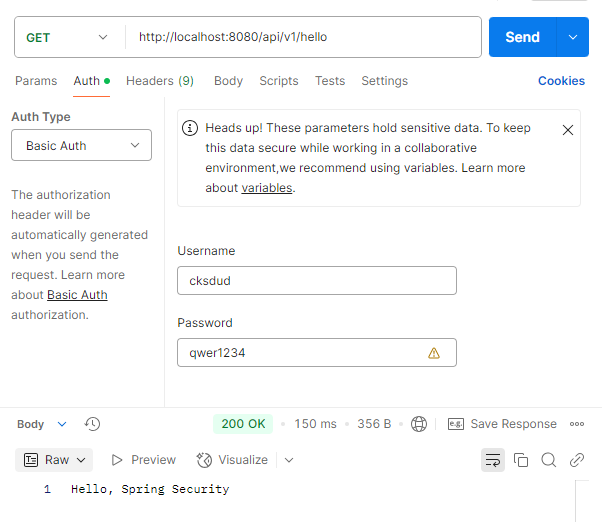

# Part A. 로그인, 로그아웃, 회원가입으로 배워보는 스프링 시큐리티 기초
## Ch 2. 스프링 시큐리티 기초

### 03. 기본 구성 재정의
- 기본 설정의 값을 재정의 하는 방법 알아보기 : UserDetailsService, PasswordEncoder

### UserDetailsService 구성요소 재정의
- InMemoryUserDetailsManager 구현체를 이용하여 기본 구성을 재정의하는 방법 알아보기 : 스프링 빈으로 등록할 수 있음  
```java
package com.spring.security.config;

import org.springframework.context.annotation.Bean;
import org.springframework.context.annotation.Configuration;
import org.springframework.security.core.userdetails.UserDetailsService;
import org.springframework.security.provisioning.InMemoryUserDetailsManager;

@Configuration
public class SecurityConfig {

    @Bean
    public UserDetailsService userDetailsService() {
        return new InMemoryUserDetailsManager();
    }
}
```
- 위와 같이 하고 로컬에서 애플리케이션을 실행시켜보면 더 이상 비번이 노출되지 않음
- WHY?
    - 기본으로 구성된 UserDetailsService 구현체 대신 스프링 컨텍스트에 반영된 UserDetailsService, 즉 InMemoryUserDetailsManager를 이용함
    - 하지만 사용자와 PasswordEncoder를 적용하지 않았기 때문에 REST 엔드포인트에 접근 불가능 -> 접근 가능하게 하기 위해 테스트 사용자 등록
```java
@Bean
public UserDetailsService userDetailsService() {
    InMemoryUserDetailsManager inMemoryUserDetailsManager = new InMemoryUserDetailsManager();
    UserDetails cksdud = User.builder().username("cksdud").password("qwer1234").build();
    inMemoryUserDetailsManager.createUser(cksdud);
    return inMemoryUserDetailsManager;
}
```
- UserDetailsService를 재정의했다면 PasswordEncoder도 재정의해줘야 한다.

### PasswordEncoder 재정의
- PasswordEncoder로 NoOpPasswordEncoder를 활용함
```java
package com.spring.security.config;

// 생략

@Configuration
public class SecurityConfig {

    @Bean
    public PasswordEncoder passwordEncoder() {
        return NoOpPasswordEncoder.getInstance();
    }
}
```



- NoOpPasswordEncoder 란? 비밀번호에 암호화를 적용하지 않고 평문 그대로 사용하는 PasswordEncoder
1. deprecated 되었기 때문에 개발 환경에서만 사용하고 운영환경에서는 절대로 사용하지 않는 것이 좋음
2. PasswordEncoder 인터페이스를 상속받아 구현함
3. 인코딩 알고리즘이 비밀번호를 그대로 반환함
4. 비밀번호를 비교하는 로직은 단순 문자열.equals()

### 엔드포인트에 따른 접근 권한 부여 재정의
- 엔드포인트에 따라 접근하도록 허용하거나 제한할 수 있음
    - SecurityFilterChain, WebSecurityCustomizer에 대한 스프링 빈을 재정의할 수 있음
    - SecurityConfig를 클래스 내 설정하면 됨
```java
package com.spring.security.config;

// 생략

@Configuration
public class SecurityConfig {

    @Bean
    public SecurityFilterChain securityFilterChain(HttpSecurity httpSecurity) throws Exception {
        httpSecurity
                .authorizeHttpRequests((auth) -> auth.anyRequest().authenticated())
                .httpBasic(withDefaults());
        return httpSecurity.build();
    }
}
```    
